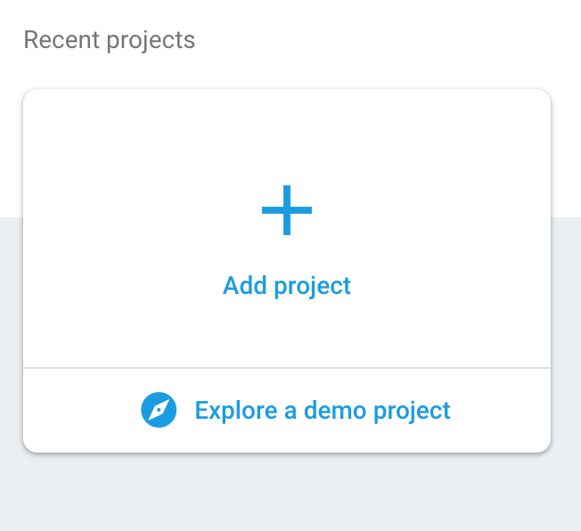
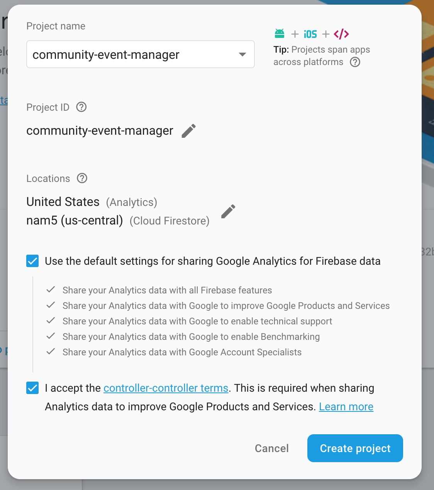
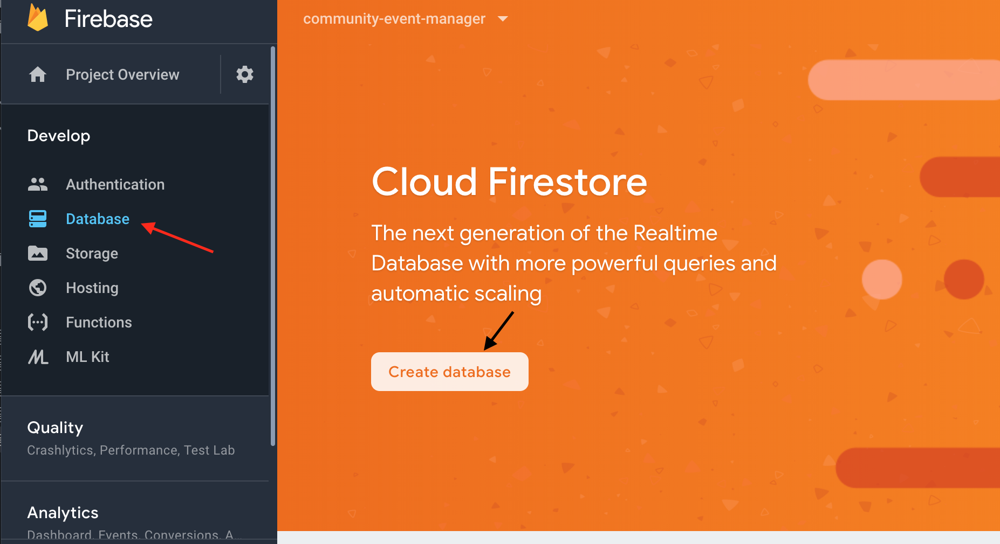
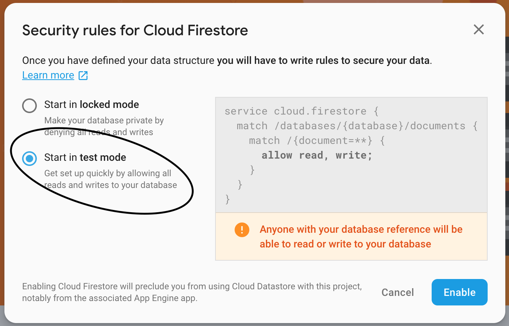
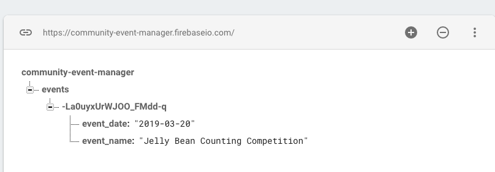

# Build a Community Board with Flask and Firebase (with a little help from Pyrebase)

I've been scouring the web for good resources on connecting a Flask application to Firebase, and I'm telling you, it's slim pickings. In this post (or series of posts, if this gets too long), I'm going to show you how to build out a fully functioning CRUD application using Firebase. You could do this much more easily using Django or a more robust framework, but what's the fun in that? I love the fact that Flask is such a lightweight framework and that it's so open and flexible.

The project we're going to be building out is an **community event event board**- a place where users (who are logged in) can post events for their neighbors. Think of it as the digital version one of those coffee shop bulletin boards where folks can see what is happening in their neighborhood.

Note: We're assuming some knowledge of Flask already since we're not starting from scratch. You should be able to create a basic app using routes, jinja2 templates, forms, and static files.

## Part 1: Flask Starter Code

### Initial setup

We're going to start by downloading and opening a template that will get us going without too much setup.

```bash
git clone https://github.com/upperlinecode/using-firebase-and-flask
cd using-firebase-and-flask
rm -rf .git
```
Once you've done this, open the project in your text editor, and then run the following commands in the terminal to install the flask and python-dotenv (for our environment variables) packages:

```bash
pip install flask
pip install python-dotenv
```

### Run the application

Run the app by typing the following command in to your terminal:

```bash
flask run
```
This will fire up the local server, and get your app running at the default port 8080. Open it up in a browser by navigating to http://localhost:8080/

### Examine the existing codebase

Take a look at what currently exists. We'll start at our controller: the `routes.py` file. In this file we see:

* Importing packages that we currently need.
* A global variable `events` that is holding an array of dictionaries with each event's information. We'll eventually replace this with a Firebase database.
* Our routes and the functions that are called when those routes are triggered by a url.
  * When '/' or '/index' are triggered, the index() function is run and the `index.html` template is rendered. We pass in the `events` variable to be templated in using jinja2.
  * When '/events/new' is triggered, the new_event.html page is rendered, with a form that posts event data back to the controller. In the controller, the form data is unpacked from the request and appended to the `events` variable. After this is done we redirect back to the '/' route.

  Take some time to follow the flow of the code here.

## Part 2: Firebase Setup

### Database Setup

In order to replace our array of dictionaries with a real database, we need to do some basic setup on Firebase. Head to [firebase.google.com](www.firebase.google.com), sign up, and then create a new project.



Go through the popup and give your project a (relevant) name:



Congratulations! You've initialized your first Firebase project! You're not quite there yet though.

Once you see your dashboard, head over to the database section and click on "create database".



You'll want to start your database up in "test mode" so that you don't need user authentication quite yet.



Once the database is created, make sure you switch the dropdown from "cloud firestore" to "realtime database":


### Installing Pyrebase

We're going to use a Python wrapper for the Firebase API called [Pyrebase](https://github.com/thisbejim/Pyrebase). Let's add it to our project by running:

```bash
pip install pyrebase
```
In our routes.py file, add `import pyrebase` to the import section at the top of the page.

### Connecting to your Firebase DB

To connect to your firebase database, you'll need to set up a dictionary variable with your configuration data in your `routes.py` file. The `authDomain`, `databaseURL`, `projectId`, and `storageBucket` should all use the name you gave your firebase project during setup.

```python
config = {
  "apiKey": os.environ['FIREBASE_API_KEY'],
  "authDomain": "community-event-manager.firebaseapp.com",
  "databaseURL": "https://community-event-manager.firebaseio.com",
  "projectId": "community-event-manager",
  "storageBucket": "community-event-manager.appspot.com",
  "serviceAccount": "app/firebase-private-key.json",
  "messagingSenderId": "1052538486567"
}
```

** Important: Do not expose your API Key or the JSON file with your private key! Put your API key in an environment variable in your `.env` file - and make sure not to upload that file to github (it is ignored by default in this repository)! **

This is what your .env file (in the root directory of your project) should look like:

```
LC_ALL=C.UTF-8
LANG=C.UTF-8
FIREBASE_API_KEY=AIzaSyCn1qXoa7sdfe7vgyce9E71SbcBa3s
```

You'll also want to go to your settings -> Service Accounts and then generate a new private key. That will download a JSON file that you can connect to your config variables. In the example below, we renamed the JSON file `firebase-private-key.json` and we also added that file to the `.gitignore` so that it doesn't get tracked by git and uploaded to github.

Back to the routes.py file - once you've set up your config variable correctly, add the following code underneath:

```Python
firebase = pyrebase.initialize_app(config)
db = firebase.database()
```
This code connects to our project using our configuration data, and then creates a `db` variable to interact with the Firebase database that we created earlier.

## Part 3: Using Firebase

You've hooked up your local application to your Firebase database using Pyrebase. Now it's time to start using the `db` variable you created earlier to get and send data to the database.

### Sending data to Firebase

Let's go back and take a look at what happens when the "New Event" form is posted to our controller.

```python
def new_event():
    if request.method == "GET":
        return render_template('new_event.html')
    else:
        new_event = dict(request.form)
        events.append(new_event)
        return redirect('/')
```

We currently append the `new_event` variable (that comes from the form) to the `events` list that we created earlier on. Unfortunately that events list will not persist (save) our data, so we're going to replace this with a call to our firebase `db` variable:

```python
def new_event():
    if request.method == "GET":
        return render_template('new_event.html')
    else:
        new_event = dict(request.form)
        db.child("events").push(new_event) #replaces appending to events variable with firebase db call.
        return redirect('/')
```
To test if this worked (you won't see anything change on the index page since we haven't updated it yet), head to the Firebase Console and open up your project, clicking on the 'database' section. You should see that the event you submitted is now a "node" in your database, under the node "events" (which was created as well since this was your first upload to that node - future submissions to `db.child("events")` will just add on to that node).



Try submitting a few more events to see what this looks like in the Firebase console.

### Retrieving data from Firebase

Now let's turn to pulling in our Firebase content, rather than sending new information to the database. We are currently doing this in the routing for our `/index` page by accessing the `events` list and sending it through to the template for rendering:

```python
def index():
    return render_template('index.html', events = events)
```

Go ahead and delete the events variable defined at the top of the page - you're not going to need that anymore since you're moving to Firebase. Next, inside of our `index()` method we'll create a new variabe called `db_events` that pulls in the data we want from Firebase (the "events" node), and we'll pass that in to our template for rendering:

```python
def index():
    db_events = db.child("events").get().val().values()
    return render_template('index.html', events = db_events)
```
Now reload your app and you should hopefully see data getting pulled in from your Firebase database!

### Practice
You're not going to get good at Flask and Firebase unless you get a lot of practice. Here are a few things you can try doing to solidify this knowledge:

- Add a 'locations' form on a new page where users can upload different locations events might take place. Save these to a new node in your firebase db.
- Add another field to your events form and then make sure that that content gets rendered correctly on your index page
- Build a similar app to inventory anything else you're interested in: animals, groceries, todo items, etc.

## References and Resources

- [Firebase](https://firebase.google.com)
- [Pyrebase Github Repo](https://github.com/thisbejim/Pyrebase)
- [Heating up With Firebase: Tutorial on how to Integrate Firebase into your App](https://blog.devcolor.org/heating-up-with-firebase-tutorial-on-how-to-integrate-firebase-into-your-app-6ce97440175d)

## Setup:

Code to clone and break reference:
```bash
git clone https://github.com/upperlinecode/flaskproject
cd flaskproject
rm -rf .git
```

Install flask & dotenv packages:
```bash
pip install flask
pip install python-dotenv
```
[troubleshooting](#troubleshooting-package-installation)

Code to configure your flask app (run once each time you open a new terminal - only necessary if python-dotenv won't install):
```bash
export FLASK_APP=main.py
export FLASK_RUN_HOST=0.0.0.0
export FLASK_RUN_PORT=8080
export FLASK_DEBUG=1
export LC_ALL=C.UTF-8
export LANG=C.UTF-8
```

Code to run flask:
```bash
flask run
```

## Virtual Environments (optional)

If you're running this locally, you may want to run this program inside a virtual environment - that way changes to your Python configuration don't persist and impact other python programs on your machine.

To create a virtual environment (you only need to do this once), run this code in terminal:
```bash
python -m venv venv
```

To ENTER your virtual environment (you'll need to do this every time you open up a new terminal), run this code:
```bash
. venv/bin/activate
```

To EXIT your virtual environment (you'll want to do this if you decide to change projects - think of it like shutting this one down), you just need one word:
```bash
deactivate
```

If you're using a virtual environment like Codenvy, the virtual environment produces more problems than it solves, so consider skipping this step.

## Python packages

The only packages you need to run are `flask` (for obvious reasons), and `python-dotenv` which allows us to store configuration information in the files `.env` and `.flaskenv`.

To install these packages, run this code.
```bash
pip install flask
pip install python-dotenv
```
Remember, if you're using a virtual environment, these packages will only be installed IN the virtual environment (which is part of why we don't recommend it if you don't need it - students will accidentally forget where they've configured different settings).

If this has worked, and python-dotenv is working, then running a flask application is pretty simple:
```bash
flask run
```

### Troubleshooting package installation

If your IDE throws errors on either of these commands saying that you aren't authorized, your account may not be authorized to install packages on the IDE you're using, so try adding the 'switch user and do' command ('sudo' for short):
```bash
sudo pip install flask
sudo pip install python-dotenv
```

If you encountered errors with the python-dotenv package, we can still configure those settings manually. You'll need to run these commands once each time you open a terminal:
```bash
export FLASK_APP=main.py
export FLASK_RUN_HOST=0.0.0.0
export FLASK_RUN_PORT=8080
export FLASK_DEBUG=1
export LC_ALL=C.UTF-8
export LANG=C.UTF-8
```

After that you should be able to execute the `flask run` command normally.

## Codenvy Run Command:

Here's the you'll want to run in your custom command:
```bash
cd <your-directory-name-here>
export FLASK_APP=main.py
export FLASK_RUN_HOST=0.0.0.0
export FLASK_RUN_PORT=8080
export FLASK_DEBUG=1
flask run
```
If you clone this directly, your `<your-directory-name-here>` will be `flaskproject`.

Here's the code for to generate your preview URL:
```bash
http://${server.port.8080}
```

## Local Run Command

Running locally is simpler. Just navigate to the your flask project in the command line, and then run the following commands:
```bash
export FLASK_APP=main.py
export FLASK_DEBUG=1
flask run
```

You can also simplify this to just `flask run` if you `pip install python-dotenv` and then use the `.flaskenv` file to hold the flask app and the debug settings.  
